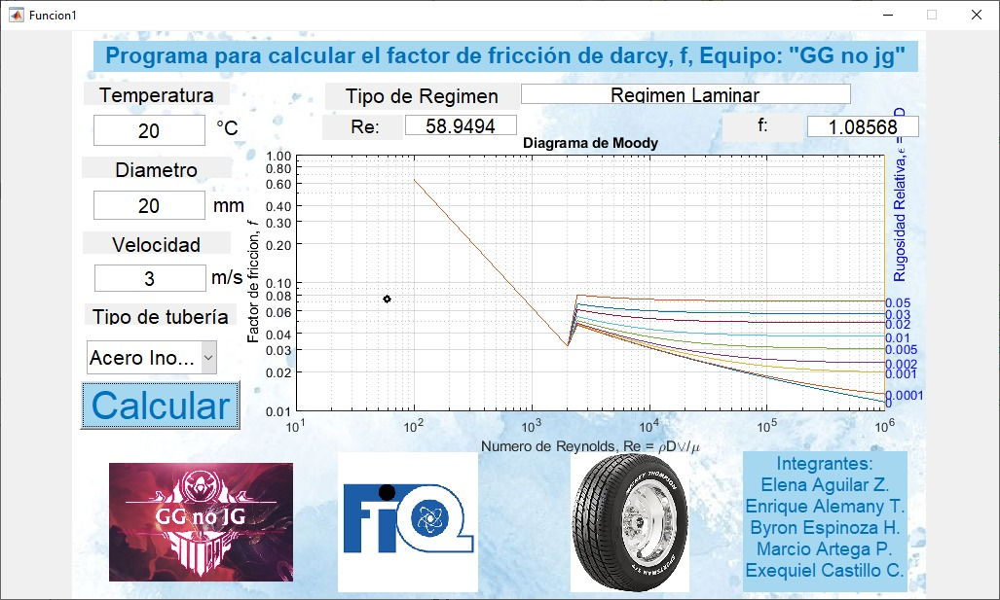
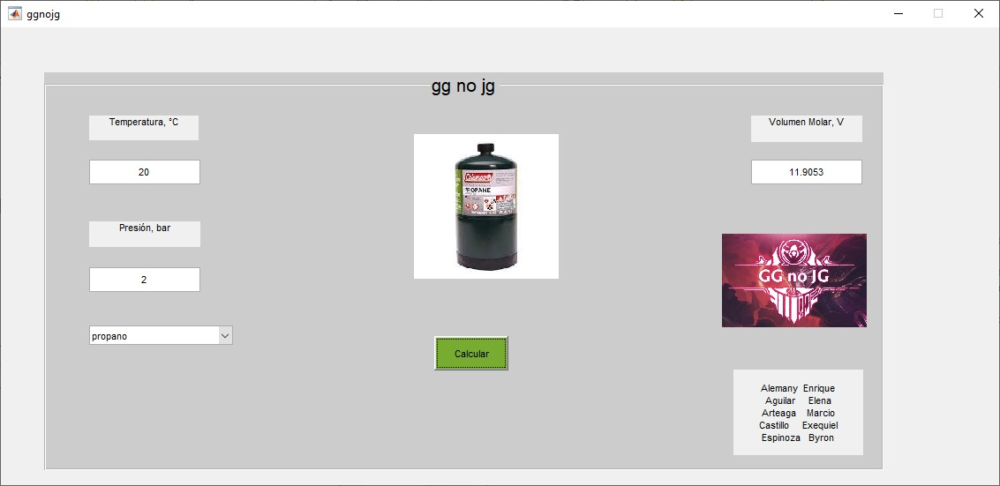
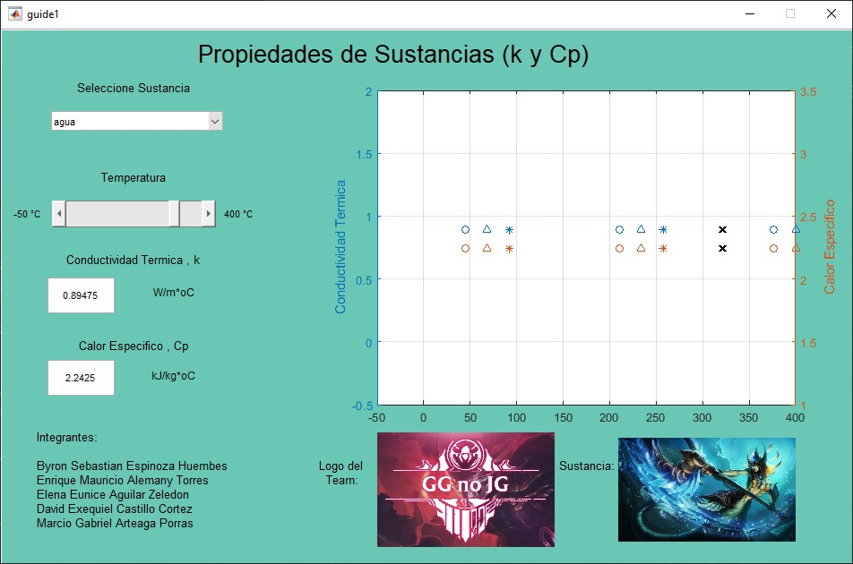

## <h1> Repositorio de Matlabworks- README.md  </h1>

Repositorio que contiene el trabajo de fin de curso de la materia de Introducción a La Programación hechos en matlab con la función GUIDE.  

(Esta imagen no es nuestra, creditos a su respectivo autor)

## Tabla de contenidos:
---
- [Descripción](#Descripción)
- [Matlab](#Matlab)
- [1) Mecánica de Fluidos](#mecánica-de-fluidos)
- [2) Termodinámica](#Termodinámica)
- [3) Propiedades de Sustancias](#propiedades-de-sustancias)
- [4) Nómina Semanal](#nómina-semanal)
- [Indicaciones](Indicaciones#)
- [Autores](#Autores)
---
## Descripción
Trabajo de fin de curso de la materia Introducción a la Programación. Consta de 4 ejercicios de Matlab(3 de interfaz gráfica (GUIDE) y 1 que es solo el algoritmo) los cuales de describen en el archivo de pdf Indicaciones. Y cada ejercicio también es descrito en su sección. En cada una de las carpetas se encuentran los archivos .m y .fig para el funcionamiento de los mismos. Se recomienda no cambiar el nombre ni borrar ninguno de los archivos contenidos en la carpeta para que los programas funcionen bien. 

## Matlab

Para poder ejecutar los archivos de este repositorio se debe contar con el sistema de cómputo numérico Matlab. Para la realización de este trabajo se hizo uso de una licencia de estudiante asociada a nuestra matrícula en la Universidad. 
Para obtener este sowtware: https://la.mathworks.com/products/matlab.html

## 1) Mecánica de Fluidos
Este ejercicio calcula el número de Reynolds, determina el tipo de régimen y el coeficiente de fricción de darcy (f) a partir de introducir: La temperatura, el diámetro de la tubería y la velocidad de esta. 
Para determinar el tipo de tubería se hizo uso de un popupmenu en matlab. 
Imagen del programa.

La tercera imagen era porque pidieron que subieramos una imagen que nos gustara y fue una desición bien random. 

## Termodinámica
Se le pide al usuario que introduzca la temperatura y la presión de la sustancia de la que desea conocer el volumen molar. 

Imagen del programa.

## Propiedades de sustancias

En este ejercicio se calcula la conductividad térmica y el calor específico de una lista de sustancias en las que se puede ir viendo la variación de esta en una gráfica la cual cambia el valor haciendo uso de un Slider. 

 

Imagen del programa.

## Nómina Semanal 
En este ejercicio se pide realizar un algoritmo para determinar el salario de un empleado en función de las horas que laboró y el coste de estas. Al no ser un archivo con interfaz gráfica no se muestra una imagen del mismo.

## Indicaciones

Archivo pdf con las indicaciones para realizar los programas presentes en el repositorio 

## Integrantes
---
---
- Elena Aguilar
- Marcio Arteaga
- Sebastian Espinoza
- Exequiel Castillo
- Enrique Alemany

Estudiantes de Ingeniería Química en la Universidad Nacional de Ingeniería de Nicaragua
---
